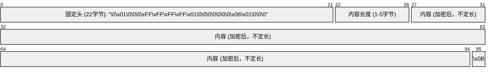

空洞骑士和丝之歌的存档文件放在打开之后是一串乱码，显然是加密过的。本文简单讲一下它使用的加密算法。

<!-- more -->

存档文件的结构如图所示：



---

首先是22个字节的固定头：`"\0\x01\0\0\0\xFF\xFF\xFF\xFF\x01\0\0\0\0\0\0\0\x06\x01\0\0\0"`。

---

接下来是内容长度，用以表示内容部分的长度。它类似于 Protobuf 的 Varint（变长整型）编码方式，我们来详细讲一下。首先它是小端 (little-endian) 存储的，换句话说就是低位在前高位在后。并且它是不定长的。我们知道一个字节有8位(bits)，这里最高位预留出来，只用低7位来存储数字，这样就可以存储7 bits的数字。如果这个字节没存完，后续还有更多的字节，就把预留出来的最高位标记为1即可。

为了更通俗易懂一些，我们用`65543`举个例子，`65543`的二进制表示是`10000000000000111`：
1. 最低的7位是`0000111`，因为还没完，所以最高位标记为1，得到`10000111`，用十六进制表示就是`"\x87"`
2. 接下来的7位是`0000000`，也还没完，所以最高位标记为1，得到`10000000`，用十六进制表示就是`"\x80"`
3. 接下来是`100`，因为已经结束了，所以最高位保留0，仍然是`100`，用十六进制表示就是`"\x04"`
4. 由于是小端 (little-endian) 存储的，我们低位在前高位在后拼起来，得到`"\x87\x80\x04"`

我们用Python代码描述这个内容长度（变长整型）的序列方式如下：

```python :no-line-numbers :no-collapsed-lines
def generate_length_prefixed_string(length):
    length = min(0x7FFFFFFF, length) # 最大支持一个32位有符号整型
    b = bytearray()
    for i in range(4): # 4+1=5个字节可以代表5*7=35位，足够了
        if length >> 7 != 0:
            b.append(length & 0x7F | 0x80)
            length >>= 7
        else:
            b.append(length & 0x7F)
            length >>= 7
            break
    if length != 0:
        b.append(length)
    return b
```

---

再接下来是使用ECB（Electronic Code Book）模式的AES加密，关于AES加密很复杂，这里就不详细讲解了，各大主流语言都有标准库或第三方库支持AES加密算法，直接调用即可。

密钥是固定的`UKu52ePUBwetZ9wNX88o54dnfKRu0T1l`，空洞骑士和丝之歌都是这个密钥。

AES加密算法是以每16个字节为一个块，如果总长度不是16的整数倍，就需要进行填充，使最终的总长度变为16的整数倍。这里采用的是pkcs7规则进行填充，这个规则很简单，就是比如还差3个字节才能凑齐16的倍数，就填上3个`"\x03"`，还差4个字节就填上4个`"\x04"`，还差12个字节就填上12个`"\x0C"`，以此类推。对于恰好是16的倍数的情况下，为了避免混淆，就规定这种情况也要进行填充，类似地也填充16个`"\x10"`。

然后把填充好的数据进行ECB模式的AES加密，加密后对其进行base64编码。

我们以Python为例，首先安装依赖：

```bash
pip install pycryptodome
```

接下来是加密的代码（其中`data`是需要加密的内容）：

```python :no-line-numbers
import base64
from Crypto.Cipher import AES
from Crypto.Util.Padding import pad

cipher = AES.new(KEY, AES.MODE_ECB)
padded = pad(data, AES.block_size)
encrypted = cipher.encrypt(padded)
encoded = base64.b64encode(encrypted)
```

---

最后是一个固定的`"\x0B"`字符结尾。

---

以上是存档文件加密的算法，将加密算法反过来操作，就是解密算法。

我用Python将其进行了实现，放在了[https://github.com/CuteReimu/hollow_user_data](https://github.com/CuteReimu/hollow_user_data)，欢迎自取。
