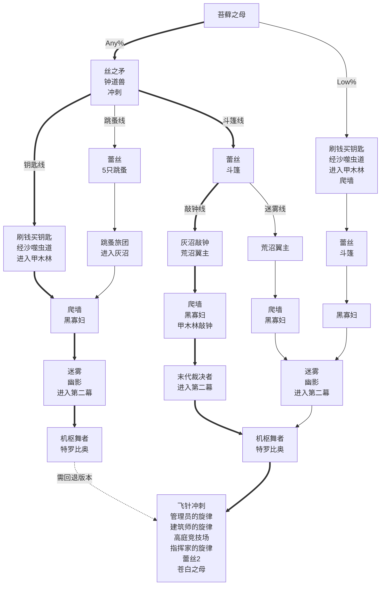

<!-- more -->

## Any% 路线

::: note 注意

- 如果只是为了刷5小时通关成就，建议参考[这篇文章](5hour.md)。
- 在最新版本下，tc修复了各种skip，因此主流路线一定是斗篷线。获取斗篷之后，根据进入圣咏殿的方式不同，分为敲钟线和迷雾线。**在最新版本下，敲钟线最快，下图中已将此路线标粗**。
- 在最早的版本，还有两个可行的路线：跳蚤线和钥匙线。**在回退版本的情况下，钥匙线最快，下图中已将此路线标粗**。
- Low%则不拿丝之矛、钟道兽的丝之心、冲刺，少了3点完成度。前期类似Any%钥匙线，先经由沙噬虫道进入甲木林，拿到爬墙之后，无冲刺也可以利用skip见到蕾丝，拿到斗篷后，剩下的部分与Any%迷雾线类似。

:::



## 机枢核心上层谜题

```text :no-line-numbers
1 3 3 3
2 0 0 3
0 1 1 1
1 1 0 2
```
