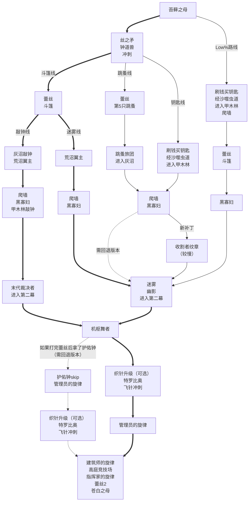

<!-- more -->

::: warning 注意

由于现在属于游戏发布初期，有很多没被发掘出来的内容，目前的路线仅供参考。

:::

## Any% 路线

::: note 注意

- 如果只是为了刷5小时通关成就，建议参考[这篇文章](5hour.md)。
- 加粗的路线（斗篷线）是目前的主流路线，而且有斗篷会大大减少后续跳跳乐的难度。
- 根据进入圣咏殿的方式不同，分为敲钟线和迷雾线。
- 跳蚤线和钥匙线曾经上限更高，但补丁之后有一处必经之路无法再通过蹭墙跳的方式通过了，必须拿收割者的纹章，时间上就没优势了。（不过，目前的最新规则允许退版本）因此，在最新版本下，主流路线是一定拿斗篷的，之后有迷雾线和敲钟线两个分支。
- 最新的补丁已经修复了护佑钟skip，如果想要使用护佑钟skip，需要回退版本。
- Low%则不拿丝之矛、钟道兽的丝之心、冲刺，少了3点完成度。前期类似Any%钥匙线，先经由沙噬虫道进入甲木林，拿到爬墙之后，无冲刺也可以利用skip见到蕾丝，拿到斗篷后，剩下的部分与Any%迷雾线类似。

:::



## 机枢核心上层谜题

```text :no-line-numbers
1 3 3 3
2 0 0 3
0 1 1 1
1 1 0 2
```
