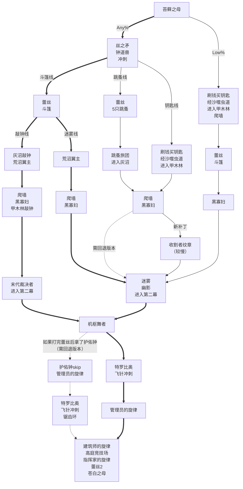

<!-- more -->

## Any% 路线

::: note 注意

- 如果只是为了刷5小时通关成就，建议参考[这篇文章](5hour.md)。
- 在最新版本下，tc修复了各种skip，因此主流路线一定是斗篷线，也就是下图中标粗的路线。获取斗篷之后，根据进入圣咏殿的方式不同，分为敲钟线和迷雾线。
- 跳蚤线和钥匙线曾经上限更高，但补丁之后有一处必经之路（建筑师房间最左边）无法再通过蹭墙跳的方式通过了，必须拿收割者的纹章，时间上就没优势了（不过，目前的最新规则允许退版本）。跳蚤线和钥匙线没有斗篷，后续的跑图都会比较牢，并且回退版本需要面对大量的二伤机关和二伤小怪，容错更低。跳蚤线可以获得跳蚤秘酿，使用时会有短暂的滞空效果，对一些skip有所帮助。钥匙线没有跳蚤秘酿，会更牢一些。**在回退版本的情况下，钥匙线最快，跳蚤线其次，都比斗篷线快。**
- 在速通的初期，大家还是会选择在特罗比奥之前进行第二次织针升级，但后续所剩战斗不多，对战斗的提升有限，且获取苍白油、开车站、织针升级浪费时间太多。速通赛道已经太卷了，目前已经没有人会去进行第二次织针升级了。
- 最新的补丁已经修复了护佑钟skip，如果想要使用护佑钟skip，需要回退版本。
- Low%则不拿丝之矛、钟道兽的丝之心、冲刺，少了3点完成度。前期类似Any%钥匙线，先经由沙噬虫道进入甲木林，拿到爬墙之后，无冲刺也可以利用skip见到蕾丝，拿到斗篷后，剩下的部分与Any%迷雾线类似。

:::



## 机枢核心上层谜题

```text :no-line-numbers
1 3 3 3
2 0 0 3
0 1 1 1
1 1 0 2
```
