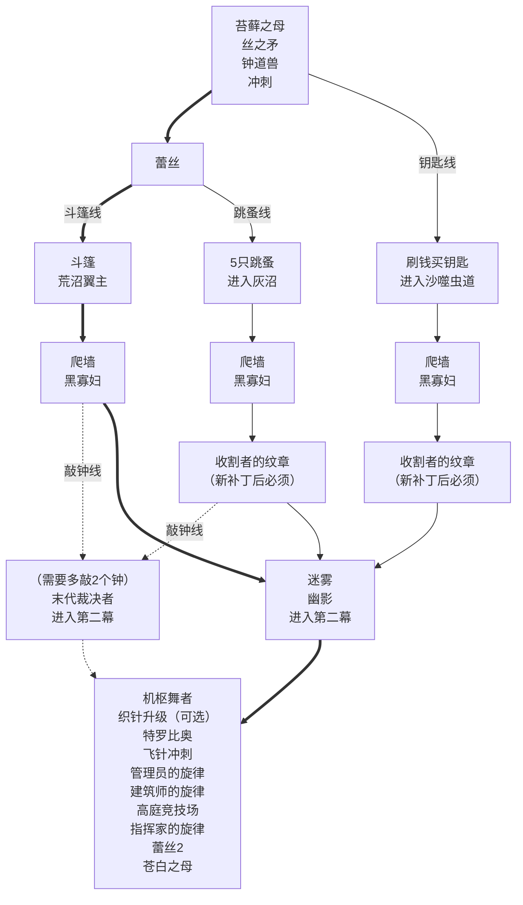

<!-- more -->

::: warning 注意

由于现在属于游戏发布初期，有很多没被发掘出来的内容，目前的路线仅供参考。

:::

## Any% 路线

::: note 注意
- 如果只是为了刷5小时通关成就，建议走最左边的路线。
- 加粗的路线（斗篷线）是目前的主流路线，而且有斗篷会大大减少后续跳跳乐的难度。
- 跳蚤线和钥匙线曾经上限更高，但补丁之后有一处必经之路无法再通过蹭墙跳的方式通过了，必须拿收割者的纹章，时间上就没优势了。
:::



## 机枢核心上层谜题

```text :no-line-numbers
1 3 3 3
2 0 0 3
0 1 1 1
1 1 0 2
```