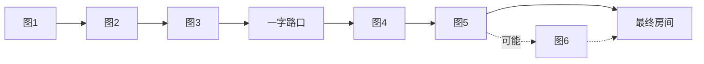

<!-- more -->

**迷瘴 (The Mist)** 是《丝之歌》中的一个地点，作为连接区域，连接着**罪途**与**腐汁泽**的子区域**管风琴**。这使得玩家无需完成第一幕的敲钟任务即可进入圣咏殿（开启第二幕）。

该区域是一个迷宫区域，进入后，玩家会被传送到 8 个房间之一，每个房间有多个出口。每个出口会随机通向剩下的 7 个可能房间中的一个，其中一个出口是正确出口。如果进入了错误出口，就会回到迷宫的起点。

为了识别正确出口，玩家必须对着成群的**光蛾**弹琴，它们会指引玩家找到正确出口。**由于此机制，弹琴是推进迷宫进程的硬性要求**。从第二个房间之后，会出现幽灵怪攻击玩家，阻碍玩家的前进。每个房间有各种陷阱，并且大多数房间的下方都有虚空，坠落虚空或其他原因死亡也会重置迷宫。

[::b:bilibili =20 /#FE7398:: 点击跳转到B站视频讲解](https://www.bilibili.com/video/BV1H5pUzmEiD)

## 迷瘴机制

1. 图与图从物理上是连通的，从前一张图的左侧出口出去，就会从后一张图的右侧进来，这叫做**物理连通性**。
2. 在任意一张图（例如图2），我们管进来的地方叫做入口，如果直接从入口出去，不算作走错，虽然你回到了前面的一张图，但是此时还算作图2，但是出口会被重新roll。这个机制我们叫做**回溯**。如果后面一张图太大或者前面一张图好跑，**回溯**可以降低跑图难度。
   - 上面这个技巧在图4不能使用，因为使用后会回到一字路口，你必须再跑到一字路口对面，才算作图4，很浪费时间。
3. 一字路口肯定是横着的，要么从左进从右出，要么从右进从左出。考虑到**物理连通性**，图3有这样一个机制：所有左/右出口都是正确出口，不需要弹琴确认。（考虑到**回溯**机制，你不能从入口直接出去）
4. 最终房间类似也是横着的，一定从左进从右出。考虑到**物理连通性**，图5的正确出口一定是右侧。
   - 如果图5有两个右侧出口，你需要弹琴确认；（*8张图只有两张大图有两个右侧口*）
   - 如果图5只有一个右侧出口，就是正确答案；
   - 如果图5没有右侧出口，那么就会多出来一个图6，你可以**回溯**来避免出来一个图6。（*8张图只有一张图没有右侧口*）
   - 你需要考虑前面的**回溯**机制，例如图5有两个右侧口，但是其中一个是入口，那另一个肯定是出口。例如图5只有一个右侧口，但它是入口，那等于是没有右侧出口。

::: details 方案参考

目前相对比较效率且记忆成本低的方案是这样的（仅供参考）：
1. 弹琴过图1
2. **回溯**（回到上一张图）再弹琴过图2
   - 考虑到记忆成本，我们刚才上一张图刚刚跑过，相对较熟，不需要记
3. 在图3直接从左或者右侧最方便的出口出去（如果图1方便，也可以回溯一下）
4. 穿过一字路口
5. 弹琴过图4
6. 图5直接前往右出口，但是需要考虑以下情况：
   - 无右出口的图只有一张，需要记一下，遇到这张图则**回溯**
   - 有两个右侧口的图只有两张，仅在这两个右侧口都不是入口的情况下，则需要弹琴（上述条件全都满足，属于RNG很糟糕的情况），根据图4的方便程度考虑要不要**回溯**，如果不**回溯**，虽然需要弹琴确认，但既然是速通，最后这50%几率猜一个
   - 如果图4可以很方便到达**唯一**的右出口，则可以在图5**回溯**

记忆成本是只需要记那张无右侧口的图（观察三个口的样子，方便一进图就能判断），其它适当记忆即可（跑的过程中能认出来）。

:::

## 光蝇

（**待确认**）有一种说法是，即使使用了上述**回溯**机制回到了上一个房间，光蝇位置也不会重新刷，此结论有待确认。**如果这一点是真的**，当你发现某张地图的光蝇位置非常好到达，进入下一张图之后你可以**回溯**到上一个房间，并继续弹琴，以加快速通的速度。这个策略可以用在图1进入图2。

## 幽灵

迷瘴中的主要危险是幽灵敌人。一般而言，每个房间幽灵最多可能出现的数量满足以下条件：
- 首次进入图1，不会刷新幽灵。进入错误出口再次回到图1，最多刷新2个幽灵。
- 从图2开始，图N最多会刷新N个幽灵，上限为5。
- 较小的房间最多只会刷新3个幽灵，即使它作为图4及以后的地图。