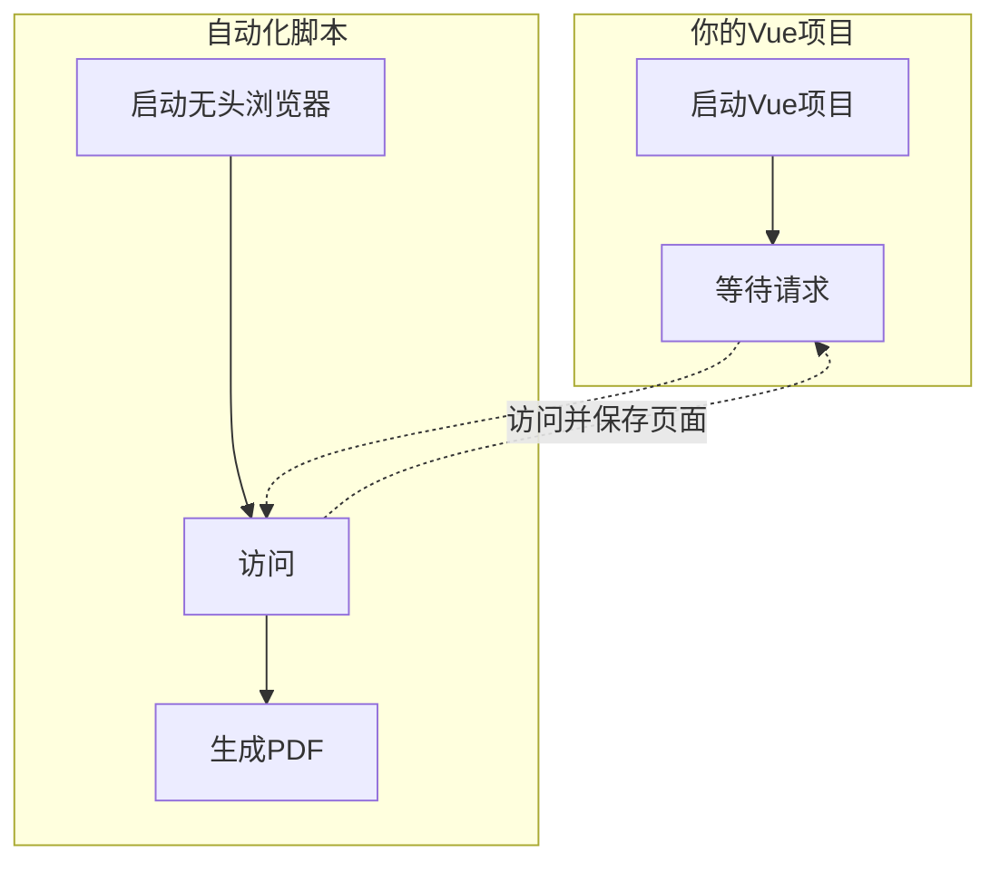

假如我们有一个Vue项目，希望将整个Vue项目的不同页面（通过路由访问的各个页面）导出，然后合并成一个PDF文件。为了解决这个问题，最容易的方法就是使用浏览器自带的保存页面功能。

如果我们要用程序来实现，实际上可以不需要真的有这么一个浏览器，确切说是不需要浏览器真的显示出来页面的内容，只需要它将页面加载好，供我们保存即可。于是就有了这样一个概念——**无头浏览器**。

<!-- more -->

所谓**无头浏览器**，就是这种不需要真的把内容显示出来的浏览器，它们大多数是对一些市面上常用浏览器的阉割，把界面部分去掉。相比普通浏览器，无头浏览器对资源的占用会更少，很适合我们这个需求。

现在不同语言都有很多无头浏览器的库供我们使用，例如 Javascript 中就有 Puppeteer、Playwright 等。

下文我们将以 Puppeteer 为例，展开讲述具体的实现方案：

## 核心思路



## NodeJs 实现

首先，新建一个node项目，并安装依赖：

```bash
npm install puppeteer pdf-merger-js
```

在项目根目录创建自动化脚本 `generate-pdf.mjs`：

```javascript {15-20} :no-collapsed-lines title="generate-pdf.mjs"
import puppeteer from 'puppeteer';
import PDFMerger from 'pdf-merger-js';
import fs from 'fs';
import path from 'path';
import { fileURLToPath } from 'url';

// 兼容 __dirname
const __filename = fileURLToPath(import.meta.url);
const __dirname = path.dirname(__filename);

// 本地服务配置
const PORT = 8080; // 确保与本地服务端口一致
const BASE_URL = `http://localhost:${PORT}`;

// 需要导出的路由列表（根据你的路由配置填写）
const ROUTES = [
  '/',
  '/about',
  '/contact'
];

(async () => {
  // 启动浏览器
  const browser = await puppeteer.launch({ headless: 'new' });
  const page = await browser.newPage();
  const merger = new PDFMerger();

  // 遍历所有路由
  for (const route of ROUTES) {
    const url = `${BASE_URL}${route}`;
    await page.goto(url, { waitUntil: 'networkidle0' });
    
    // 处理页面异步内容（例如数据请求）
    // 可选：添加自定义等待逻辑
    await page.waitForTimeout(1000); // 等待1秒确保内容渲染 // [!code error]

    // 生成PDF文件名
    const pdfPath = path.join(__dirname, 'temp', `${route.replace(/\//g, '_')}.pdf`);

    // 生成PDF（A4纵向布局）
    await page.pdf({
      path: pdfPath,
      format: 'A4',
      printBackground: true,
      margin: { top: '20mm', right: '20mm', bottom: '20mm', left: '20mm' }
    });

    // 合并PDF
    await merger.add(pdfPath);
  }

  // 保存合并后的PDF
  await merger.save('vue-project.pdf');
  await browser.close();

  // 清理临时文件
  fs.rmSync(path.join(__dirname, 'temp'), { recursive: true, force: true });
  console.log('PDF生成完成！');
})();
```

::: important 非常重要
1. 注意上文中的高亮行（第15-20行），你需要将所有页面的URL列在这里。如果页面较多，你也可以自行写逻辑获取所有页面的URL。
2. 注意上文中的报错行（第35行），在最新版的 Puppeteer 中，这个函数已经没有了，你需要增加一个等待时间，确保页面已经加载完毕（尤其是一些懒加载的内容）。你也可以采用事件监听的方式判断页面已经加载完毕，这可能会更靠谱一些。
:::

运行你的Vue项目：

```bash
cd your/vue/project/path
npm run serve
```

确保Vue项目运行成功后，就可以执行脚本了：

```bash :no-line-numbers
# 创建临时文件夹
mkdir temp
# 运行脚本
node generate-pdf.mjs
```

::: note 注意
因为 `pdf-merger-js` 从 v4.0.0 开始只支持 ESM 模块，你应当检查 `package.json`，确保支持 ESM。

```json title="package.json"
{
  "type": "module"
}
```
:::

## Go 实现

这里也贴一个Go语言的实现，使用了`github.com/go-rod/rod`这个第三方库：

```go :no-collapsed-lines {32} title="main.go"
package main

import (
    "github.com/go-rod/rod"
    "github.com/go-rod/rod/lib/launcher"
    "github.com/go-rod/rod/lib/utils"
    "image"
    "image/png"
    "time"
)

func main() {
    // 创建浏览器
    browser := rod.New().Sleeper(func() utils.Sleeper {
        return utils.EachSleepers(rod.DefaultSleeper(), utils.CountSleeper(30))
    }).ControlURL(launcher.New().
        Headless(true). // 强制无头模式
        NoSandbox(true). // 禁用沙箱
        Set("disable-gpu", ""). // 禁用 GPU 加速
        MustLaunch()).
        MustConnect()

    // 打开页面
    page := browser.MustPage("https://xxx.com/xxx.html")
    if page == nil {
        slog.Error("获取页面失败")
        return
    }
    defer page.MustClose()

    // 等待页面加载
    time.Sleep(time.Second)
    // 截图
    page.MustScreenshotFullPage("screenshot.png")
}
```

这里只简单展示了对一个页面进行截图并保存，可以稍加修改，依次截图每个页面并合并为一个PDF文件。同样地，代码中的高亮行也应当替换为一个自定义等待逻辑，确保页面已经完全加载完毕。

使用方法同上，先运行你的Vue项目，再运行此Go代码即可。