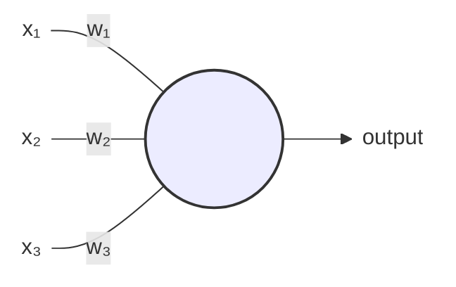
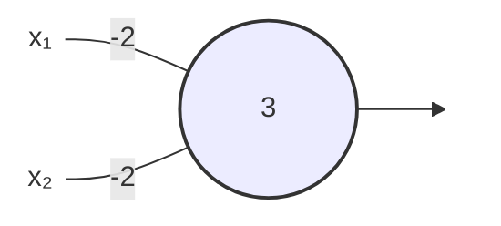

::: important 重要

这篇文章是我看完《Neural Networks and Deep Learning》一书后的个人读书笔记。本文的风格更加偏向于对有一定数学基础的人的科普，并非专业文章。如果你是相关专业的学生或者专业人士，在学习和研究过程中应该考虑研读权威书籍，请勿以本文作为参考。如有理解错误，欢迎指正。

:::

本文主要围绕着如何识别手写数字展开。具体来讲就是给定一个28x28的纯灰度图的手写数字图像，如何判断它是0-9中的哪个数字。我们将使用一个简单的神经网络来实现这个功能。

## 感知器

$$
\text{output} =
\begin{cases}
0 & \text{if } \sum_jw_jx_j \le \text{threshold} \\
1 & \text{if } \sum_jw_jx_j > \text{threshold}
\end{cases}
$$

如图，我们有三个输入$x_1$、$x_2$、$x_3$（0或1），分别对应权重$w_1$、$w_2$、$w_3$。它们的线性组合经过一个激活函数后输出一个结果output（0或1）。

我们令 $z = w_1x_1 + w_2x_2 + w_3x_3$，如果 $z \le \text{threshold}$，则 $\text{output} = 0$；如果 $z > \text{threshold}$，则 $\text{output} = 1$。这里threshold是我们给定的一个阈值。

这就是一个感知器。

举个例子，比如今天我想去某个地方玩，我正在决定是否要去。我到底去不去，取决于以下三种因素：
- 今天天气如何，1代表晴，0代表下雨
- 目的地离地铁近不近，1代表近，0代表远
- 有没有人一起去，1代表有，0代表无

然后我给这三种因素分别赋予一个权重：
- 假设我并不是很在意天气，令$w_1 = 2$
- 假设我也并不介意离地铁站距离，令$w_2 = 2$
- 假设我很关心有没有人一起去，令$w_3 = 6$

那么，根据不同的阈值，我们可以得到不同的结果：
- 如果阈值为5，说明不管天气如何、不管距离地铁站远近，我去不去只取决于有没有人一起去。
- 如果阈值为3，说明如果天气好，我就去；如果天气不好，但是离地铁站近并且有人一起去，我也去。

接下来，我们用多个感知器组合起来，就可以形成一个感知器网络：

对于上面这个式子

$$
\text{output} =
\begin{cases}
0 & \text{if } \sum_jw_jx_j \le \text{threshold} \\
1 & \text{if } \sum_jw_jx_j > \text{threshold}
\end{cases}
$$

我们做两个简写：
- 我们把$(w_1,w_2,\cdots,w_j)$看做一个向量$\vec{w}$，$(x_1,x_2,\cdots,x_j)$看做一个向量$\vec{x}$。它们一一对应相乘后求和，可以用向量的点乘表示$\vec{w}\cdot\vec{x}$
- 我们把threshold移项到左边来，用$b=-\text{threshold}$代替它

这样，我们可以写成下面这种漂亮的形式

$$
\text{output} =
\begin{cases}
0 & \text{if } \vec{w}\cdot\vec{x} + b \le 0 \\
1 & \text{if } \vec{w}\cdot\vec{x} + b > 0
\end{cases}
$$

### 与非门

我们来讨论一种特殊的感知器：

- 输入$x_1=1$、$x_2=1$，则$\vec{w}\cdot\vec{x} + b=-2-2+3<0$，输出$0$
- 输入$x_1=1$、$x_2=0$，则$\vec{w}\cdot\vec{x} + b=-2+3>0$，输出$1$
- 输入$x_1=0$、$x_2=1$，则$\vec{w}\cdot\vec{x} + b=-2+3>0$，输出$1$
- 输入$x_1=0$、$x_2=0$，则$\vec{w}\cdot\vec{x} + b=3>0$，输出$1$

当且仅当$x_1$和$x_2$都为$1$时，最终输出才为$0$，这就是经典的**与非门**。既然有了**与非门**，那么我们很容易就能得到**加法器**，这里就不展开介绍了。

我们有这样一个好消息：因为计算机就是由一个一个与非门搭建起来的，所以只要我们搭建足够大的感知器网络，就能使它和其他计算设备一样强大。\
但坏消息是：它看上去只不过是一种新的与非门。\
不过还有一个好消息是：我们可以设计一个算法，来自动调整权重$\vec{w}$和偏置$\vec{b}$。这就是所谓的学习算法。

## 神经网络

如果$\vec{w}$或者$\vec{b}$产生微小的改变，会引起output的微小改变，我们就可以通过微调，使输出变得越来越好，这个过程就是学习的过程。

但是前面的感知器并不可以，因为当结果跨过阈值的时候，输出会发生突变。我们要想个办法平滑这种突变。

我们进行一个微小的改动，我们允许0到1之间的任何值作为输入，并且令：

$$
\text{output} = \sigma(z) \equiv \frac{1}{1+e^{-z}}\\
$$

其中$z = \vec{w}\cdot\vec{x} + b$。这个就叫做**sigmoid function**，函数图像如下：

这样一来，我们用光滑的曲线代替了阈值threshold的突变，同时也将输出output限制在了0和1之间。

接下来，我们要重新定义一下神经网络：

其中，最左边一列叫做**输入层**，最右边一列叫做**输出层**，中间的叫做**隐藏层**。每一层的每一个节点都和下一层的每一个节点相连，这个就叫做**全连接**。

### 使用神经网络识别手写数字

我们的每个数字都是大小为$28\times 28=784$个像素的灰度图像，我们将它展平为一个784维的向量$\vec{x}$。我们将每个像素点的灰度值（0-255）除以255，变成0-1之间的数值，其中0.0代表白色，1.0代表黑色。

一共有0-9十个输出，每个输出的值可以视为“是这个数字的可能性”，我们简单地把输出值最大（“可能性最大”）的那个输出作为对应判断的数字。

::: note 注意

这里说的“可能性”并不是数学意义上的“概率”，只是我为了方便理解而做的一个比喻。

:::

MNIST 数据分为两个部分。第一部分包含 60000 幅用于训练数据的图像。这些图像扫描自 250 人的手写样本。这些图像是 $28\times 28$ 大小的灰度图像。第二部分是 10000 幅用于测试数据的图像，同样是 $28\times 28$ 的灰度图像。我们将用这些测试数据来评估我们的神经网络学会识别数字有多好。为了让其有好的测试表现，测试数据取自和原始训练数据不同的另外一组 250 人。这有助于确保我们的系统能识别那些没有看到训练数据的人写的数字。

我们首先给$\vec{w}$和$\vec{b}$的每个分量填上均值为0、方差为1的随机数。

对于训练集的数据，输入和输出都是已知的，例如这个数字是 6 ，对应的 0-9 的输出应该是 $(0, 0, 0, 0, 0, 0, 1, 0, 0, 0)$ 。根据输入的数据，我们带入计算，也可以得到一个输出。这两个输出之间会存在一个误差。

我们用这样一个函数来描述误差的大小：

$$
C(w, b) \equiv \frac{1}{2n}\sum_x||y(x) - a||^2
$$

这个就叫做**代价函数**。**代价函数**是误差的体现。

我们的目的是调整$\vec{w}$和$\vec{b}$，使代价函数最小。

我们知道，只要沿着梯度的方向移动，就可以使C减小。

对于二维的$\vec{v}=(v_1, v_2)$，我们有：

$$
\begin{aligned}
\Delta C & = \frac{\partial C}{\partial v_1} \Delta v_1 + \frac{\partial C}{\partial v_2} \Delta v_2\\
\nabla C & = \left(\frac{\partial C}{\partial v_1}, \frac{\partial C}{\partial v_2}\right)^T\\
\Delta C & \approx \nabla C \cdot \Delta \vec{v}\\
\Delta \vec{v} & = -\eta \nabla C\\
\vec{v} \to \vec{v}^{\prime} & = \vec{v} - \eta \nabla C
\end{aligned}
$$

对于多维的$\vec{v}=(v_1, v_2, \cdots, v_n)$，上述公式同样有效。

有了这个公式，我们就可以很容易得到每一层的每一个$w$和$b$的值了：

$$
\begin{aligned}
\vec{v} \to \vec{v}^{\prime} & = \vec{v} - \eta \nabla C\\
w_k \to w_k^{\prime} & = w_k - \eta \frac{\partial C}{\partial w_k}\\
b_k \to b_k^{\prime} & = b_k - \eta \frac{\partial C}{\partial b_k}
\end{aligned}
$$

这样一来，我们的目标就变成了，求出代价函数$C$对$w_k$和$b_l$的偏导数。

先做一个简单的定义：

$b^l_j$表示第$l$层第$j$个神经元的偏置，$a^l_{j}$表示第$l$层第$j$个神经元的激活值（经过**sigmoid function**之前的值）。

## 反向传播算法

推到过程较为复杂，这里省略，直接给出结论。

1. 首先正向推导，得出输出层误差$\delta$
2. 下一层的误差推倒当前层的误差：$\delta^l = ((w^{l+1})^T\delta^{l+1})\odot\delta^{\prime}(z^l)$
3. 求出代价函数的梯度：$\frac{\partial C}{\partial w^l_{jk}} = a^{l-1}_k \delta^l_j$ 和 $\frac{\partial C}{\partial b^l_j} = \delta^l_j$
4. 沿梯度方向按照某一个步长更新权重和偏置

为此，我用 Java 实现了这样一个识别手写数字的逻辑：[https://github.com/CuteReimu/MNIST-Template](https://github.com/CuteReimu/MNIST-Template)

::: warning 注意

这个实现是纯手写的，只为检验我对算法的理解。如果真的想要学习神经网络，建议使用 TensorFlow、PyTorch 等深度学习框架。

:::