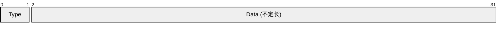
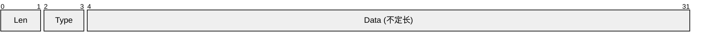
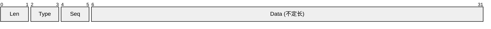

在编写网络应用时，服务端对客户端的协议设计是一个非常重要的环节。本文将介绍业界常见的通信协议设计思路。

## 序列化与反序列化

我们知道，对于面向对象编程（OOP），在程序的内存中，数据一般是`struct`、`object`等封装好的类型。而在网络上进行交互，却只能使用二进制流。因此就存在这样两个问题：
- 如何将内存数据转化为二进制流？我们称之为**序列化**
- 如何将二进制流转化为内存数据？我们称之为**反序列化**

关于序列化与反序列化，我个人习惯将其分类为两种，一种是**可视化**的，内存对象序列化之后，仍然是易读的，方便调试代码时进行查看。一种是**纯字节**的，内存对象的每个基础字段都被转化为字节流（例如`int32`占4个字节），此方式效率更高，得到的序列化后的字节流长度更短，在性能方面更有优势。

### 可视化

最常用的可视化序列化方式就是JSON，它支持字符串、数字、布尔值、`null`等基本类型，也支持数组、对象等组合类型：
- 数字、布尔值、`null`等类型，直接写即可，例如`10`、`true`、`null`等。
- 字符串使用双引号括起来，例如`"hello world"`。特殊字符需要进行转义，转义方式同大部分编程语言，例如`"\""`。
- 数组使用方括号括起来，数组的每个元素可以是任何类型，例如`[1, 2, 3]`。
- 对象（键值对）使用花括号括起来，键必须是字符串，值可以是任何类型。键和值之间用冒号分隔，键值对之间用逗号分隔，例如`{"name": "Alice", "age": 30}`。

上述类型之间都可以互相嵌套使用，没有什么限制。任何一对标记之间都可以插入空格、换行等空白符，方便阅读。举个例子：

```json :no-line-numbers
[
  {"id": 1, "name": "Alice", "age": 30},
  {"id": 2, "name": "Bob", "age": 25},
  {"id": 3, "name": "Charlie", "age": 35}
]
```

可以看出，非常可读且易懂。JSON基本可以涵盖我们常用的各种数据结构，并且主流语言的标准库中基本都提供了JSON的序列化和反序列化函数，方便我们直接使用。

值得一提的是，任何一个JSON数据结构放在Javascript代码中都可以直接使用：

```js
var a = [
  {"id": 1, "name": "Alice", "age": 30},
  {"id": 2, "name": "Bob", "age": 25},
  {"id": 3, "name": "Charlie", "age": 35}
]
console.log(a[1].name)
```

这也是为什么在网页编程（浏览器端编程）时，大家普遍喜欢使用JSON作为序列化和反序列化的格式。

除了JSON外，XML、YAML、TOML等都可以用来序列化和反序列化，除了编码格式不一样以外，其它方面基本上都是大同小异了。这里拿XML举个例子：

```xml :no-line-numbers
<Users>
  <User id="1" name="Alice" age="30"/>
  <User id="2" name="Bob" age="25"/>
  <User id="3" name="Charlie" age="35"/>
</Users>
```

当然，你也可以针对自己的业务逻辑自创一个序列化方式，例如金融行业非常喜欢使用的类FIX报文格式：

``` :no-line-numbers
|id|name|age|
|1|Alice|30|
|2|Bob|25|
|3|Charlie|35|
```

尽管这个设计对不同数据结构的支持明显不如上述JSON、XML等，但金融行业的数据有它独到的特点：数据量非常大（行数非常多）、字段值固定（列数固定）、无需复杂的嵌套数据结构。使用JSON、XML等会带来每一行都需要加上字段名的冗余，反而使用这样的自定义结构会更加有性能优势。

### 纯字节

大多数语言都提供了将内存数据结构转化为纯字节流的方式，例如Java中的`Serializable`和`ObjectOutputStream`，Go中的`encoding/gob`包，在使用单个语言的项目中非常好用。但是，一旦发生跨语言（例如服务端使用Java或Go，客户端使用C#），这种方法就行不通了。

那么，有没有一个支持各种语言的序列化和反序列化方式呢？

有的，有这样一个非常常用的方式：protobuf，使用文档在：[https://protobuf.dev/](https://protobuf.dev/)。它的使用方式也很简单：

首先前往[下载页](https://github.com/protocolbuffers/protobuf/releases)，根据你的操作系统下载最新版本并解压，解压后的`bin`目录下就会有一个名为`protoc`的可执行文件。为方便使用，建议将`bin`目录加入系统环境变量的`PATH`中。

接下来，创建一个`.proto`文件，用来声明你的结构体，例如`example.proto`：

```protobuf title="example.proto"
message Person {
  string name = 1;
  int32 id = 2;
  string email = 3;
}
```

然后我们就可以使用`protoc`根据声明文件来生成代码了：

```bash
# [!code word:--java_out=.]
protoc --java_out=. example.proto
```

注意这里的`--java_out`参数用来指定生成Java代码的路径，你也可以用`--go_out`等来指定生成对应语言代码的路径。这样就会生成一个同名的代码文件，在上述例子中会生成一个`Person.java`文件，其中包含`Person`类的定义以及序列化和反序列化代码。

::: note 注意

protobuf官方已经内置支持了C++、C#、Java、Kotlin、Objective-C、PHP、Python、Ruby等语言，对于[Dart](https://github.com/google/protobuf.dart)、[Go](https://github.com/protocolbuffers/protobuf-go)语言，也提供了官方实现，但需要额外安装相应的插件。对于其它语言，你也可以在Github上的其它仓库找到一些非官方实现。

:::

生成好后，我们就可以使用生成的代码进行序列化了，我们以Java为例：

```java
Person john = Person.newBuilder()
    .setId(1234)
    .setName("John Doe")
    .setEmail("jdoe@example.com")
    .build();
OutputStream output = new FileOutputStream(args[0]);
john.writeTo(output);
```

将序列化后的二进制流发给对方，对方接收后，就可以用生成的代码（可能是另一种语言）来进行反序列化，我们以C++为例：

```cpp
Person john;
fstream input(argv[1], ios::in | ios::binary);
john.ParseFromIstream(&input);
int id = john.id();
std::string name = john.name();
std::string email = john.email();
```

上述听起来复杂，总结一下，其实很简单：
1. 安装`protoc`
2. 编写`.proto`文件定义数据结构
3. 使用`protoc`生成服务端和客户端代码
4. 使用生成的代码进行序列化和反序列化

---

到这里，我们已经解决了序列化和反序列化的问题，但还有一个问题没有解决：在通信过程中，有多种不同类型的消息（登录、心跳、各种类型请求），如何进行区分呢？

## 包的组装

服务端和客户端的通信一般分为两种，短连接（例如HTTP）和长连接（例如纯手写TCP、Websocket）。对于HTTP，就很简单了，我们只需要使用不同的url来区分是什么请求，接下来就可以对不同的请求解析不同的消息参数了。这里我们主要讨论长连接通信。

### Websocket

Websocket的每一个包已经从协议层拆解好了，所以应用层拿到包的时候都是一段段独立的字符串/字节数组。我们需要在这个字符串/字节数组中，既能够区分是什么请求，又包含请求参数。

如果采用JSON、XML等进行序列化和反序列化，最常用设计思路就是在外面再套一层：

```json :no-line-numbers
{
  "type": 10,
  "data": [
    {"id": 1, "name": "Alice", "age": 30},
    {"id": 2, "name": "Bob", "age": 25},
    {"id": 3, "name": "Charlie", "age": 35}
  ]
}
```

其中，`type`字段用来区分这条消息是什么请求，一般使用数字或者字符串，`data`字段是请求参数。

如果采用protobuf来进行序列化和反序列化，也可以考虑采用这个方案，外面套一层：

```protobuf :no-line-numbers
import "google/protobuf/any.proto";

message Message {
  int32 type = 1; // 消息类型
  google.protobuf.Any data = 2; // 消息内容
}
```

设计思路和上述JSON的例子类似。进一步地，对于强类型语言，其实`google.protobuf.Any`结构体中已经包含了消息类型，外面的`type`字段完全可以省略，之后在编程语言中使用类型断言等方式判断`data`的类型，从而区分是哪种消息。

但这种方案也有明显的缺点，实际上在`google.protobuf.Any`结构体中存储的消息类型是一个完全展开的可视化字符串，这样一来就完全失去了纯二进制序列化的优势（字节流长度短）。因此我们就有了另外一种方案，自行拼接：



如上图所示，我们只需要提前约定，前2个字节（0-65535）用一个`short`类型的数字来代表上述所说的`type`，后续剩余的字节就是请求对象序列化后的二进制流即可。反序列化时，我们先截取前2个字节，转化为一个`short`类型的数字，以此来找到对应是哪种消息，然后再将后续的字节流反序列化为对应的对象即可。

### 纯手写TCP

对于纯手写TCP，并不会像Websocket那样自动拆包，我们需要支持反序列化时能够将字节流正确地拆分成一个一个包。最常用的方式就是在包的开头添加包的长度，例如：



如上图所示，我们同样可以约定，前两个字节（0-65535）用一个`short`类型的数字来代表包的长度（如果包超过64K长度不够可以换成4个字节的`int`），后续内容和上文的Websocket中使用protobuf的方案一致即可，2个字节的`type`字段，剩余部分是序列化后的字节流。

这里使用Go语言给个简单的例子来展示一下发送端和接收端的代码：

```go {23} :no-collapsed-lines
// 发送端
func (conn *Conn) write(messageType uint16, data proto.Message) {
    dataBuf := proto.Marshal(data) // 序列化
    buf := make([]byte, len(dataBuf)+4)
    binary.LittleEndian.PutUint16(uint16(len(dataBuf)+2)) // 前2个字节写入包长度
    binary.LittleEndian.PutUint16(buf[2:], uint16(传入messageType)) // 后续2个字节写入type
    copy(buf[4:], dataBuf) // 剩余部分即是序列化后的二进制流
    conn.Write(buf)
    conn.Flush()
}

// 接收端
func (conn *Conn) read() proto.Message {
    // 前2个字节是包长度
    lenbuf := make([]byte, 2)
    _, _ = io.ReadFull(conn, lenbuf)
    reqlen := binary.LittleEndian.Uint16(lenbuf)
    // 后续2个字节是type
    typeBuf := make([]byte, 2)
    _, _ = io.ReadFull(conn, typeBuf)
    reqType := binary.LittleEndian.Uint16(typeBuf)
    // 剩余部分二进制流需要反序列化
    m := genMessageByType(reqType) // 根据type值，由预先加载好的消息类型映射生成对应的消息对象
    buf := make([]byte, reqlen-2)
    _, _ = io.ReadFull(conn, buf)
    proto.Unmarshal(buf, m)
    return m
}
```

注意上述代码中的高亮行，需要在程序加载时就指定好哪个消息类型对应哪个消息对象，这个函数就需要自行实现（或写脚本生成）了。

## 应用层方案设计

到这里，我们已经可以完整地进行服务器和客户端之间的通信了，也基本可以实现我们的功能需求了。但是，在大型项目中，我们需要考虑一些特殊情况，例如网络环境不好等问题。因此，在绝大部分项目中，都把协议分为三类：
- 由客户端发送给服务端的**请求协议**
- 对应上述请求协议的**返回协议**
- 服务端主动发送给客户端的**通知协议**

从客户端角度看，为了及时确认是否断网，一般要求**请求协议**和**返回协议**一一对应，但凡某个请求没有收到返回，即可判定出现了异常，就可以采取断线重连等措施。

那么问题就来了，如何让请求协议和返回协议一一对应呢？其中一个方案就是提前定义好，例如采用“奇偶法”，请求协议的`type`用`2N`，对应的返回协议的`type`就使用`2N+1`。或者进一步地，由于**请求协议**一定是客户端&rarr;服务器，而**返回协议**一定是服务器&rarr;客户端，它们之间不会发生冲突，完全可以将一一对应的协议使用相同的`type`值。这是目前非常常用的一种解决方案。

我们继续考虑另外一个设计问题：如果服务端和客户端约定，当客户端进行一个非法请求后（例如玩家钱不够仍然要买东西），服务端返回一个**通用的错误协议**，这样客户端可以非常容易地根据**通用的错误协议**弹窗提示用户。这是一个十分合理的设计，可以降低客户端的设计复杂度，但会带来一个新的问题：如果客户端连续发多条请求，如果服务端返回一个**通用的错误协议**，客户端怎么知道它对应哪一个请求呢？

为了解决这个问题，也有一个非常通用的方案，客户端在**请求协议**中加一个编号，服务端将编号原封不动返回回去，就可以精准对应了。我们以JSON为例：

```json :no-line-numbers
{
  "type": 10,
  "seq": 1, // [!code ++]
  "data": [
    {"id": 1, "name": "Alice", "age": 30},
    {"id": 2, "name": "Bob", "age": 25},
    {"id": 3, "name": "Charlie", "age": 35}
  ]
}
```

如上，我们在外层新增一个`seq`字段，作为编号。

对于protobuf，我们也可以在前面合适的位置添加2个字节，作为`seq`，例如：



到这里，对于现在非常常用的服务端-客户端协议设计方案，我们已经基本介绍完了。接下来给出几个例子，供大家参考：

- 一种基于JSON和Websocket的设计，如上文所说，请求协议和返回协议一一对应：[协议定义](https://github.com/CuteReimu/th-bingo/tree/master/doc)、[发送和接收逻辑](https://github.com/CuteReimu/th-bingo/blob/master/src/main/kotlin/Dispatcher.kt)。
- [OneBot](https://11.onebot.dev/)：一个广泛且通用的聊天机器人应用接口标准，如上文所说，请求协议和返回协议一一对应。
- 一种客户端和服务端完全异步的设计，不要求请求协议和返回协议一一对应：[协议定义](https://github.com/CuteReimu/TheMessage/tree/kotlin/src/main/proto)、[发送逻辑](https://github.com/CuteReimu/TheMessage/blob/da532b5d6ee281548e1e82aab5be5cb8adc69a52/src/main/kotlin/HumanPlayer.kt#L71-L96)、[接收逻辑](https://github.com/CuteReimu/TheMessage/blob/da532b5d6ee281548e1e82aab5be5cb8adc69a52/src/main/kotlin/network/ProtoServerChannelHandler.kt#L75-L106)。